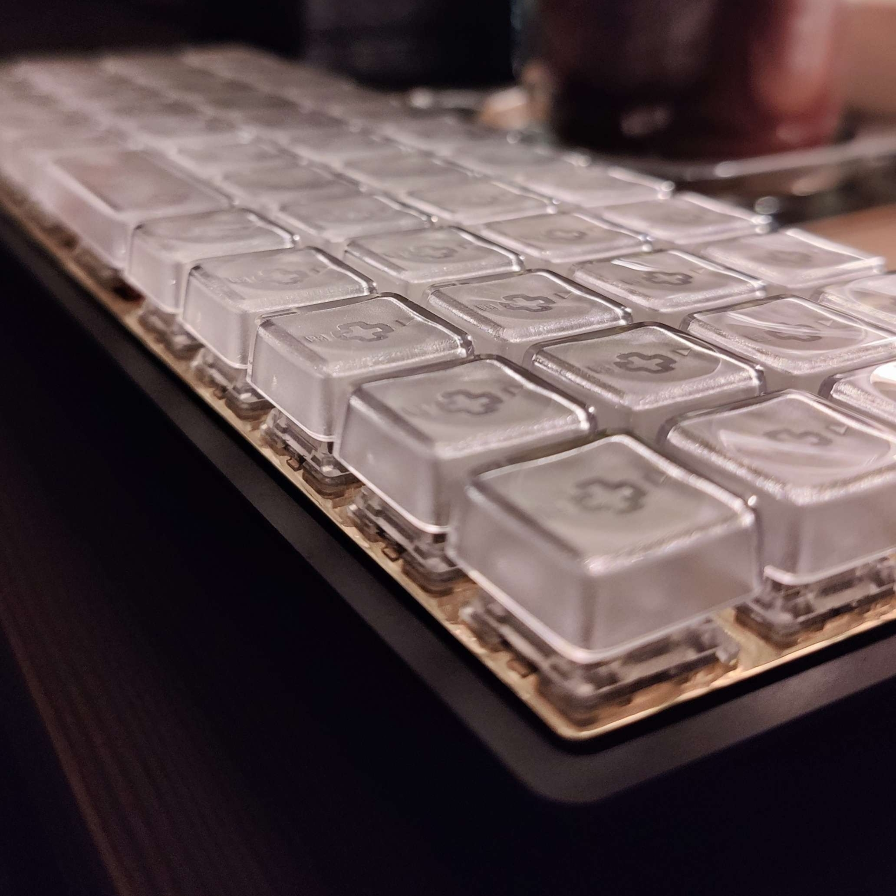

# KPRepublic BM40 // bm40hsrgb


An ortholinear 40% hotswap keyboard with per-key in-board RGB LEDs and backlight RGB LEDs, from KP Republic.

---

## About
### Hardware
* Hardware Supported: `bm40hsrgb` PCB.
* Hardware Availability: [Aliexpress](https://www.aliexpress.com/item/4001147779116.html), [KPRepublic](https://kprepublic.com/products/bm40-rgb-40-hot-swap-custom-mechanical-keyboard-pcb-qmk-underglow-type-c-planck?_pos=3&_sid=19edea37a&_ss=r&variant=34736434086051).
* Modifications: Swapped R and G channels for the per-key RGB LEDs.

### Code origin
* This code originates mainly from [QMK](https://github.com/qmk/qmk_firmware) and [Dagun/bm40](https://github.com/Dagun/bm40).
* This firmware was manually converted from the `.json` files provided by KP Republic. You may find the original `.json` files [here](https://drive.google.com/drive/folders/1tlTHQIFcluK2mjZ4UbbKCsdRLgSRSPw6).

## Usage
See the [build environment setup](https://docs.qmk.fm/#/getting_started_build_tools) and the [make instructions](https://docs.qmk.fm/#/getting_started_make_guide) for more information. Brand new to QMK? Start with our [Complete Newbs Guide](https://docs.qmk.fm/#/newbs).

### Compiling

#### Using QMK
You need to setup your QMK build environment first, see [Usage](#usage).
```
qmk compile -kb kprepublic/bm40hsrgb/rev1 -km <KEYMAP>  # FOR REVISION 1
qmk compile -kb kprepublic/bm40hsrgb/rev2 -km <KEYMAP>  # FOR REVISION 2
```
#### Using make
You need to setup your QMK build environment first, see [Usage](#usage).
```
make kprepublic/bm40hsrgb/rev1:default  # FOR REVISION 1
make kprepublic/bm40hsrgb/rev2:default  # FOR REVISION 2
```

### Flashing

#### Using QMK
You need to setup your QMK build environment first, see [Usage](#usage).
```
qmk flash -kb kprepublic/bm40hsrgb/rev1 -km <KEYMAP>  # FOR REVISION 1
qmk flash -kb kprepublic/bm40hsrgb/rev2 -km <KEYMAP>  # FOR REVISION 2
```
#### Using make
You need to setup your QMK build environment first, see [Usage](#usage).
```
make kprepublic/bm40hsrgb/rev1:default:flash  # FOR REVISION 1
make kprepublic/bm40hsrgb/rev2:default:flash  # FOR REVISION 2
```
#### Using dfu-programmer
Hint: This can be used to flash the default files provided by KP Republic.
```
sudo dfu-programmer erase --force
sudo dfu-programmer atmega32u4 flash YOUR_FIRMWARE.hex
sudo dfu-programmer reset
```

<br>
